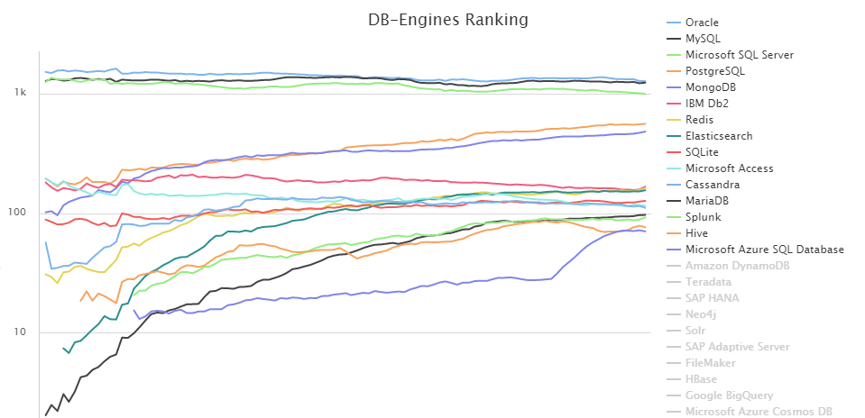

# 1. 관계형 데이터베이스 개요

### 가. 데이터베이스

---

데이터베이스는 **특정 기업이나 조직 또는 개인이 필요에 의해 데이터를 일정한 형태로 저장해 놓은 것**을 의미한다.

하지만 관리 대상이 되는 데이터의 양이 점점 많아지고 같은 데이터를 여러 사람이 동시에 여러 용도로 사용하게 되면서 보다 **효율적인 데이터 관리 및 예기치 못한 데이터 손실 회피, 필요시 복구**를 위해 데이터베이스를 관리하는 소프트웨어를 필요로 하게 되었고, 이러한 요구사항을 들어주는게 **DBMS**이다.

### 나. 데이터베이스의 발전

---

데이터베이스는 다음과 같은 순서로 발전되었다.

1. 1960년대 플로우차트 중심의 개발 방법을 사용하였고, 파일 구조를 통해 데이터를 저장 및 관리하였다.
2. 1970년대 데이터베이스 관리 기법이 처음으로 생기던 시기였으며 계층형 DB, 망형 DB 등이 상용화 되었다.
3. 1980년대 현재 대부분의 기업에서 사용되고 있는 관계형 데이터베이스가 상용화 되었다.
4. 1990년대 기존의 관계형 데이터베이스의 기능이 향상되었으며, 객체 지향의 지원을 위해 객체 관계형 데이터베이스로 발전했다.

### 나. 관계형 데이터베이스

---

1970년 처음 소개된 이후 IBM의 SQL 개발을 거쳐, Oracle을 시작으로 여러 회사에서 제품을 만들었다.

이후 관계형 데이터베이스의 장점을이 알려지게 되며, 기존의 파일시스템, 계층형, 망형 데이터베이스를 대체하게 되었고, 주력 데이터베이스로 자리잡았다.

파일 시스템의 경우 동일한 데이터가 여러 곳에 저장되는 문제가 있고, 하나의 파일에 변경 작업이 있을 때 모든 복사본에 대해 변경작업을 하지 않으면 서로 다른 정보의 파일이 발생하는 **데이터의 불일치성**이 발생한다.

> 단일 사용자나 단일 어플리케이션이 파일 시스템을 사용하는 경우 성능이 뛰어나 특정 업무에선 아직도 사용하고 있다.

### 다.관계형 데이터베이스의 장점

---

1. 관계형 데이터베이스는 **메타 데이터를 총괄**할 수 있다.
   - **데이터의 성격, 속성, 표현 방법 등을 체계화**할 수 있다.
2. 데이터 표준화를 통해 **데이터의 품질을 확보**할 수 있다.
3. DBMS는 인증된 사용자만 사용 가능하도록 **보안 기능**을 제공하고 있다.
4. 테이블 생성 시 사용할 수 있는 다양한 제약조건으로 **데이터 무결성**을 보장할 수 있다.

현재 기업에서 사용하고 있는 데이터베이스의 대부분을 차지하고 있다.

> Oracle, Mysql, SQL Server 등이 관계형 DBMS에 속한다.