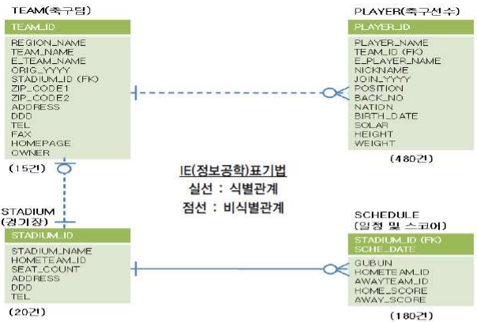
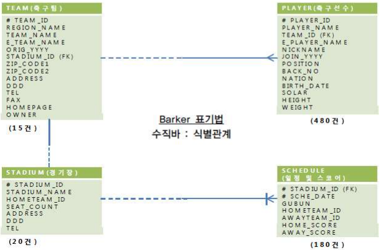

# 4. ERD

다른 테이블과 어떤 의미의 **연관이나 관계를 직관적으로 표현하는 수단**으로, ERD는 엔티티와 관계, 속성으로 구성되어 있다.

우리가 사용하게될 표기법은 **IE`(Information Engineering)`표기법과 Barker`(Case Method)`표기법**이다.

### 예제

---

축구 라는 예제에서 관계는 다음과 같다.

- 하나의 팀은 여러 선수를 포함한다.
- 하나의 선수는 하나의 팀에 꼭 포함된다.

- 하나의 팀은 하나의 전용 구장을 꼭 가진다.
- 하나의 운동장은 하나의 홈팀을 가질 수 있다.

- 하나의 운동장은 여러 스케쥴을 가질 수 있다.
- 하나의 스케쥴은 하나의 운동장에 꼭 포함된다.

이걸 IE 표기법으로 표현하면 다음과 같다.

또한 Barker 방식으로 표현하면 다음과 같다.

### ERD 선의 의미

#### IE 표기법

---

| 종류      | 의미                    |
| --------- | ----------------------- |
| 점선      | 비식별 관계             |
| 실선      | 식별 관계               |
| 원        | 관계를 가지지 않아도 됨 |
| 짧은 직선 | 관계를 꼭 가져야 함     |
| 새 발     | 여러 행과 관계를 맺음   |

#### Barker 표기법

---

| 종류  | 의미                    |
| ----- | ----------------------- |
| #     | PK                      |
| (FK)  | FK                      |
| 점선  | 관계를 가지지 않아도 됨 |
| 실선  | 관계를 꼭 가져야만 함   |
| 새 발 | 여러 행과 관계를 맺음   |

