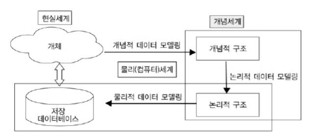
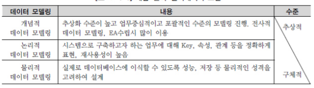

# 4. 데이터 모델링의 3단계 진행 

특별히 데이터 모델은 데이터베이스를 설계서로서 분명한 목표를 가지고 있다. 현실세계에서 데이터베이스까지 만들어지는 과정은 추상화 수준에 따라 개념적 데이터 모델, 논리적 데이터 모델, 물리적 데이터 모델로 정리할 수 있다. 

___

> 현실세계와 데이터베이스 사이의 모델 

___

처음 현실세계에서 추상화 수준이 높은 상위 수준을 형상화하기 위해 개념적 데이터 모델링을 전개한다. 개념적 데이터 모델링은 추상화 수준이 높고 업무중심적이도 포괄적인 수준의 모델링을 진행한다. EA기반의 전사적인 데이터 모델링을 전개할 때는 더 상위수준인 개괄적인 데이터 모델링을 먼저 수행하고 이후에 업무영역에 따른 개념적 데이터 모델링을 전개한다. 

엔티티(Entity)중심의 상위 수준의 데이터 모델이 완성되면 업무의 구체적인 모습과 흐름에 따른 구체화된 업무중심의 데이터 모델을 만들어 내는데 이것을 논리적 데이터 모델링이라고 한다. 논리적인 데이터 모델링 이후 데이터베이스의 저장구조를 고려한 방식을 물리적인 데이터 모델링이라고 한다. 

> 개념-논리-물리데이터 모델