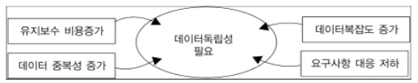
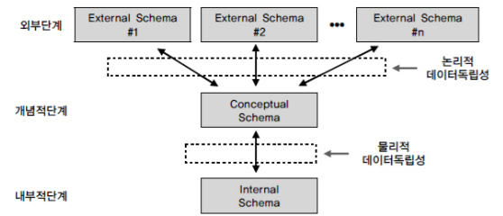

# 6. 데이터 모델링에서 데이터독립성의 이해

### 데이터 독립성의 개념

___

- 하위 단계의 데이터 구조가 변경되더라도 상위 단계에 영향을 미치지 않는 속성
- DBMS의 궁극적인 목적으로 응용프로그램이 데이터에 종속되지 않는 것
- 미국 표준 협회(ANSI) 산하의 X3 위원회(컴퓨터 및 정보 처리)의 특별 연구 분과 위원회에서 1973년 DBMS와 인터페이스를 위해 제안한 Three-Schema Architecture

### 가. 데이터독립성의 필요성 

___

 데이터독립성을 이해하기 위해서는, 데이터독립성이라고 하는 개념이 출현하게 된 배경을 이해할 필요가 있다. 데이터독립성의 반대말은 데이터 종속성이다. 여기에서 종속의 주체는 보통 Applicatoin을 지칭하는 경우이다. 

 Applicaton은 사용자 요구사항을 처리하는 사용자 접점의 인터페이스 오브젝트이다. 과거에 파일방식으로 데이터를 구성할 때는 데이터가 있는 파일과 데이터에 접근하기 위한 인덱스를 별도로 구현하여 접근하게 하였는데 사용자가 접근하는 방법(트랜잭션의 유형)에 따라 파일의 정렬순서, 인덱스의 정렬순서, 파일 구성 등을 제공하기 쉽게 별도로 구성하였다.  

 즉, 사용자가 접근하는 유형에 따라 데이터를 구성하는 방법이 영향을 받게 된다. 메인프레임 환경에서 파일방식을 사용하여 데이터처리를 했던 메인프레임 세대에는 개별로 처리했던 접근방법을 이해할 수 있으나 1990년대 이후의 Client/Server 이후 세대는 파일처리 방식 이해가 난해할 수도 있다. 

 데이터 독립성은 지속적으로 증가하는 유지보수 비용을 절감하고 데이터 복잡도를 낮추며 중복된 데이터를 줄이기 위한 목적이 있다. 또한 끊임없이 요구되는 사용자 요구사항에 대해 화면과 데이터베이스 간에 서로 독립성을 유지하기 위한 목적으로 데이터 독립성 개념이 출현했다고 할 수 있다. 

데이터독립성을 이해하기 위해서는 3단계로 표현된 ANSI 표준 모델을 살펴보면 되는데 특히 **3단계인 구조**, **독립성**, **사상(Mapping)** 3가지를 이해하면 된다. 

### 나. 데이터베이스 3단계 구조 

___

ANSI/SPARC의 3단계 구성의 데이터독립성 모델은 외부단계와 개념적 단계, 내부적 단계로 구성된 서로 간섭되지 않는 모델을 제시하고 있다. 

### 다. 데이터독립성 요소

___

|             항목              |                             내용                             |                     비고                     |
| :---------------------------: | :----------------------------------------------------------: | :------------------------------------------: |
|  외부스키마(External Schema)  | - View 단계 여러 개의 사용자 관점으로 구성, 즉 개개 사용자 단계로서 개개 사용자가 보는 개인적 DB 스키마  - DB의 개개 사용자나 응용프로그래머가 접근하는 DB 정의 | 사용자관점, 접근하는 특성에 따른 스키마 구성 |
| 개념스키마(Conceptual Schema) | - 개념단계 하나의 개념적 스키마로 구성, 모든 사용자 관점을 통합한 조직 전체의 DB를 기술하는 것 - 모든 응용시스템들이나 사용자들이 필요로 하는 데이터를 통합한 조직 전체의 DB를 기술한 것으로 DB에 저장되는 데이터와 그들의 관계를 표현하는 스키마 |                   통합관점                   |
|  내부스키마(Internal Schema)  | - 내부단계, 내부 스키마로 구성, DB가 물리적으로 저장된 형식   - 물리적 장치에서 데이터가 실제적으로 저장되는 방법을 표현하는 스키마 |               물리적 저장구조                |

데이터베이스 스키마 구조는 3단계로 구분되고 각각은 상호 독립적인 의미를 가지고 고유한 기능을 가진다. 데이터 모델링은 통합관점의 뷰를 가지고 있는 개념 스키마를 만들어가는 과정으로 이해할 수 있다. 

### 라. 두 영역의 데이터독립성

___

3단계로 개념이 분리되면서 각각에 영역에 대한 독립성을 지정하는 용어가 바로 논리적 독립성과 물리적 독립성이다. 

|    독립성     |                             내용                             |                           특징                           |
| :-----------: | :----------------------------------------------------------: | :------------------------------------------------------: |
| 논리적 독립성 | - 개념 스키마가 변경되어도 외부 스키마에는 영향을 미치지 않도록 지원하는 것  - 논리적 구조가 변경되어도 응용 프로그램에 영향 없음 | - 사용자 특성에 맞는 변경기능  - 통합 구조 변경가능 |
| 물리적 독립성 | - 내부스키마가 변경되어도 외부/개념 스키마는 영향을 받지 않도록 지원하는 것  - 저장장치의 구조변경은 응용프로그램과 개념스키마에 영향 없음 |       - 개념구조 영향 없이 물리적인 구조 변경가능        |

논리적 데이터독립성은 외부의 변경에도 개념스키마가 변하지 않는 특징을 가진다. 물론, 새로운 요건이 추가되거나 삭제될 경우 컬럼이 변경될 수 있지만 그러한 변화가 개별 화면이나 프로세스에 의해 변화된다기 보다는 전체 업무적인 요건을 고려하여 종합적으로 영향을 받음을 의미한다. 

### 마. 사상(Mapping)

___

영어로 **Mapping**은 우리말로 **사상**이라고 번역되는데 이것은 상호 독립적인 개념을 연결시켜주는 다리를 뜻한다. 데이터독립성에서는 크게 2가지의 사상이 도출된다. 

|              사상               |                         내용                         |                              예                              |
| :-----------------------------: | :--------------------------------------------------: | :----------------------------------------------------------: |
| 외부적/개념적 사상(논리적 사상) |    - 외부적 뷰와 개념적 뷰의 상호 관련성을 정의함    | 사용자가 접근하는 형식에 따라 다른 타입의 필드를 가질 수 있음. 개념적 뷰의 필드 파입은 변화가 없음 |
| 개념적/내부적 사상(물리적 사상) | - 개념적 뷰와 저장된 데이터베이스의 상호 관련성 정의 | 만약 저장된 데이터베이스 구조가 바뀐다면 개념적/내부적 사상이 바뀌어야 함. 그래야 개념적 스키마가 그대로 남아있게 됨 |

외부 화면이나 사용자에게 인터페이스하기 위한 스키마 구조는 전체가 통합된 개념적 스키마와 연결된다는 것이 논리적 Mapping이다. 또한 통합된 개념적 스키마 구조와 물리적으로 저장된 구조의 물리적인 테이블스페이스와 연결되는 구조가 물리적 Mapping이다. 데이터독립성을 보장하기 위해서는 Mapping을 하는 스크립트(DDL)를 DBA가 필요할 때마다 변경해 주어야 한다. 즉, 각 단계(외부, 개념적, 내부적)의 독립성을 보장하기 위해서 변경사항이 발생했을 때 DBA가 적절하게 작업을 해주기 때문에 독립성이 보장된다고도 할 수 있다.  (어렵다)

