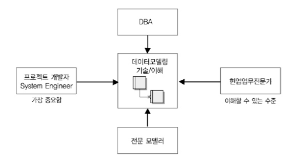

# 데이터 모델링의 이해관계자

### 가. 이해관계자의 데이터 모델링 중요성 인식

___

실제 업무시스템을 구축하는 실전 프로젝트에서는 데이터베이스를 전문적으로 하는 이른바 DBA가 데이터 모델링을 전적으로 하는 예는 거의 없다. 오히려 업무시스템을 개발하는 응용시스템 개발자가 데이터 모델링도 같이 하게 된다. 그 이유는 데이터 모델링이라는 과정이 단지 데이터베이스를 설계한다는 측면보다 업무를 이해하고 분석하여 표현하는 것이 중요하고, 표현된 내용을 바탕으로 프로젝트 관련자와 의사소통하고 프로그램이나 다른 표기법과 비교 검증하는 일을 수행하는 등 많은 시간을 업무를 분석하고 설계하는데 할애하기 때문에 업무영역별 개발팀에서 보통 데이터 모델링을 진행하게 되는 것이다. 

응용시스템을 개발하는 모든 시스템 엔지니어가 데이터 모델을 하거나 할 기회가 있음에도 불구하고 대부분의 사람들은 데이터 모델에 많은 관심을 갖지 않고 단지 프로그램을 개발하기 위한 프로그래밍 언어에만 많은 관심을 두고 애플리케이션을 개발하는 데에 훨씬 많은 시간을 투자하는 경우가 많다.

우리가 구축하려는 시스템 대부분을 데이터에 기반한, 데이터가 중심에 있는 정보시스템을 구축하기 때문에 정보시스템의 핵심에 있는 데이터베이스 설계를 잘못했을 때 미치는 영향력은 모든 프로그램, 시간에 따라 입력되는 모든 데이터, 그리고 그 데이터베이스에 발생되는 모든 트랜잭션에 영향을 미칠 수 밖에 없게 된다. 

### 나. 데이터 모델링의 이해관계자

___

그러면 누가 데이터 모델링에 대해 연구하고 학습해야 하겠는가? 첫 번째는 정보시스템을 구축하는 모든 사람(전문적으로 코딩만하는 사람 포함)은 데이터 모델링도 전문적으로 할 수 있거나 적어도 완성된 모델을 정확하게 해석할 수 있어야 한다. 즉 프로젝트에 참여한 모든 IT기술자들은 데이터 모델링에 대해 정확하게 알고 있어야 한다는 것을 의미한다. 

두 번째는 IT기술에 종사하거나 전공하지 않았더라도 해당 업무에서 정보화를 추진하는 위치에 있는 사람도 데이터 모델링에 대한 개념 및 세부사항에 대해 어느 정도 지식을 가지고 있어야 한다. 실제 프로젝트에서 보면 업무분석을 하는 도중에 현업의 업무담당자가 어느 사이에 데이터 모델링에 대해 상당한 이해를 하고 있음을 알게 된다. 그래야만 서로가 프로젝트 수행 중에 의사소통을 잘 할 수 있고 업무를 잘못 해석하여 잘못된 시스템을 구축하는 위험을 줄일 수 있게 된다. 업무를 가장 잘 알고 있는 사람이 가장 훌륭한 모델러가 될 수 있다는 사실을 나타내는 예이다. 

