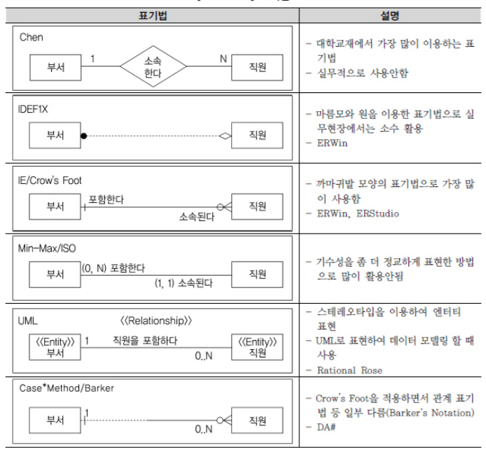

# 데이터 모델의 표기법인 ERD의 이해

### 가. 데이터 모델 표기법 

___

### 나. ERD 표기법을 이용하여 모델링하는 방법

___

##### 1) ERD 작업순서 

ERD를 작성하는 작업순서는 다음과 같다.

1. 엔티티를 그린다.
2. 엔티티를 적절하게 배치한다. 
3. 엔티티간 관계를 설정한다. 
4. 관계명을 기술한다. 
5. 관계의 참여도를 기술한다. 
6. 관계의 필수 여부를 기술한다 

##### 2) 엔티티 배치

엔티티를 처음에 어디에 배치하는지는 데이터 모델링 툴을 사용하든 사용하지 않던 중요한 문데이다. 일반적으로 사람의 눈은 왼쪽에서 오른쪽, 위 쪽에서 아래쪽으로 이동하는 경향이 있다. 따라서 데이터 모델링도 가장 중요한 엔티티를 왼쪽상단에 배치하고 이것을 중심으로 다른 엔티티를 나열하면서 전개하면 사람의 눈이 따라가기에 편리한 데이터 모델링을 전개할 수 있다. 해당 업무에서 가장 중요한 엔티티는 왼쪽 상단에서 조금 아래쪽 중앙에 배치하여 전체 엔티티와 어울릴 수 있도록 하면 향후 관계를 연결할 때 선이 꼬이지 않고 효과적으로 배치할 수 있게 된다. 

##### 3) ERD 관계설정

서로 관련있는 엔티티간에 관계를 설정한다. 초기에는 모두 Primary Key로 속성이 상속되는 식별자 관계를 설정하도록 한다. 중복되는 관계가 발생되지 않도록 하고 Circle 관계도 발생하지 않도록 유의하여 작성하도록 한다. 

##### 4) ERD 관계명의 표시

관계설정이 완료되면 연결된 관계에 관계이름을 부여하도록 한다. 관계이름은 현재형을 사용하고 지나치게 포괄적인 용어(ex. 이다, 가진다 등) 는 사용하지 않도록 한다. 

##### 5) ERD 관계차수와 선택성 표시

관계에 대한 이름을 모두 지정하였으면 관계가 참여하는 성격 중 엔티티내에 인스턴스들이 얼마나 관계에 참여하는 지를 나타내는 관계차수(Cardinality)를 표현한다. 